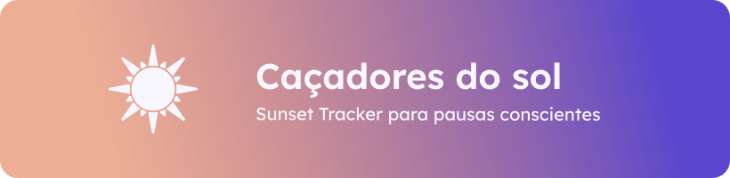
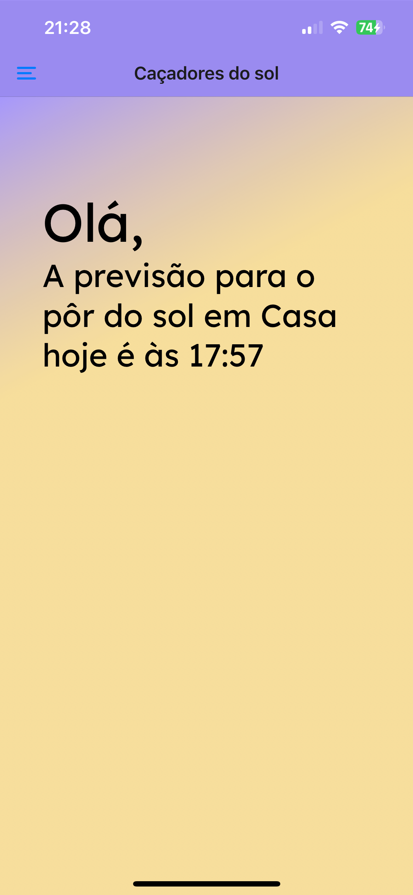
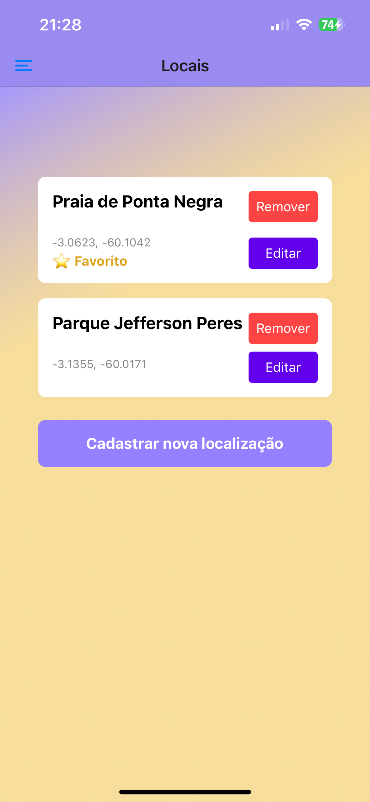
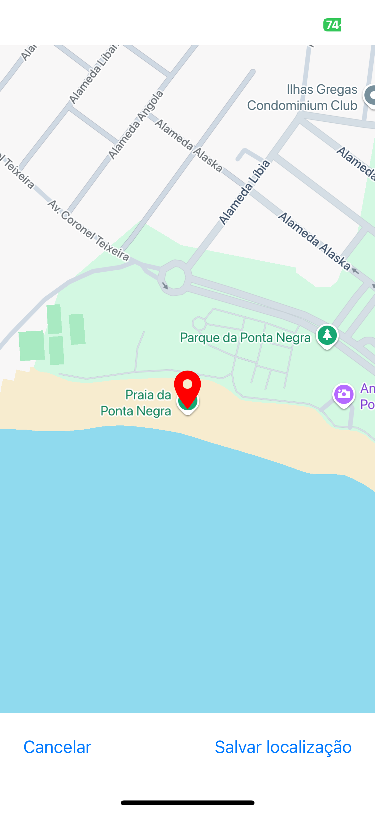
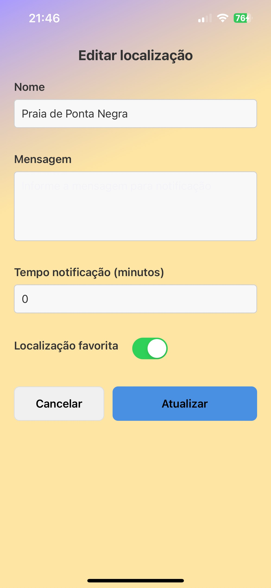

# ☀️ Caçadores do Sol

Aplicativo mobile desenvolvido com React Native + Expo Go, voltado para pessoas que desejam fazer pausas na rotina para apreciar o pôr do sol, promovendo momentos de bem-estar físico e mental. Este aplicativo foi desenvolvido, como Trabalho de Extensão da disciplina Programação Para Dispositivos Móveis em Android, no curso de Ciência da Computação da Faculdade Estácio de Sá.

## 🌅 Funcionalidades

- 📍 Cadastro de locais favoritos (CRUD completo)
- 🕓 Consulta do horário do pôr do sol em cada local
- 📬 (Em breve) Notificações personalizadas para planejamento de pausas

## 🛠 Tecnologias

- React Native com Expo
- AsyncStorage
- API pública de Sunset/Sunrise
- Axios

## 📅 Cronograma

- **Ação 1:** Entrevistas com trabalhadores autônomos/remotos (14/04–18/04)  
- **Ação 2:** Protótipos de baixa fidelidade (19/04–24/04)  
- **Ação 3:** Desenvolvimento com React Native e Expo Go (24/04–14/05)  
- **Ação 4:** Liberação do MVP para testes (14/05–21/05)  
- **Ação 5:** Coleta de feedbacks e ajustes (22/05–23/05)

## 🖼️ Telas

  
  
  
  

